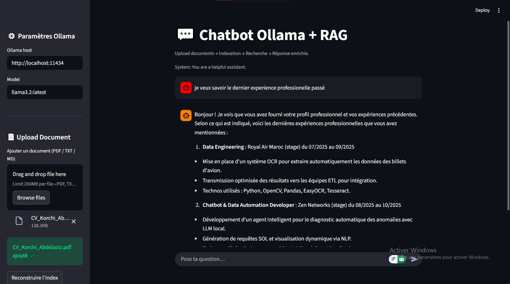

````md
# 🤖 RAG Neural Chat — Streamlit + Ollama

RAG Neural Chat est une application **Retrieval-Augmented Generation (RAG)** qui combine :
- 🧠 une **base de connaissances locale** (PDF, TXT, MD)
- 🔍 une **recherche sémantique**
- 🤖 un **LLM local via Ollama**
- 🎨 une interface **Streamlit cyber-style**

---

## 🖼️ Aperçu de l’application




---

## 🚀 Fonctionnalités

- 📄 Upload de documents (PDF / TXT / Markdown)
- 🧩 Indexation locale des documents
- 🔎 Recherche contextuelle (RAG)
- 🤖 Génération de réponses avec **Ollama**
- 💬 Interface chat moderne et animée
- ⚙️ Choix dynamique du modèle Ollama

---

## 🗂️ Structure du projet


## ⚙️ Installation

### 1️⃣ Cloner le projet

### 2️⃣ Créer un environnement virtuel

```bash
python -m venv venv
```

Activer l’environnement :

**Windows**

```bash
venv\Scripts\activate
```

**Linux / macOS**

```bash
source venv/bin/activate
```

---

### 3️⃣ Installer les dépendances

```bash
pip install -r requirements.txt
```

---

## 🤖 Installation et démarrage d’Ollama

### Installer Ollama

Télécharger Ollama depuis le site officiel :
👉 [https://ollama.com](https://ollama.com)

---

### Télécharger un modèle LLM

```bash
ollama pull llama3.2
```

---

### Lancer Ollama

```bash
ollama serve
```

✅ Ollama doit être accessible sur :

```
http://localhost:11434
```

---

## ▶️ Démarrer l’application RAG

Une fois l’environnement activé **et Ollama lancé** :

```bash
streamlit run Rag_app.py
```

Puis ouvrir dans le navigateur :

```
http://localhost:8501
```

---

## 📄 Utilisation

1. 📤 Importer un document (PDF / TXT / MD) depuis la **sidebar**
2. 🧠 Cliquer sur **Indexer le cerveau** pour générer les embeddings
3. 💬 Poser une question dans le champ de chat
4. 🤖 Le modèle Ollama répond en utilisant la **base de connaissances locale**

---

## 🧠 Principe RAG (Résumé)

```text
Question utilisateur
        ↓
Recherche sémantique (embeddings)
        ↓
Documents pertinents
        ↓
Prompt enrichi
        ↓
LLM local (Ollama)
```

---

## 🛠️ Problèmes courants

### ❌ Erreur : `ModuleNotFoundError: numpy._core`

➡️ Supprimer le fichier `embeddings.pkl`
➡️ Réinstaller NumPy :

```bash
pip install numpy==1.26.4
```

---

### ❌ Ollama ne répond pas

Vérifier que le service est actif :

```
http://localhost:11434
```

---

## 📌 Améliorations possibles

* 🔐 Authentification utilisateur
* 📚 Multi-base de documents
* 🧠 Mémoire longue durée
* 🌐 Déploiement cloud
* 🗃️ Support Word / HTML

---

## 👨‍💻 Auteur

**Abdelaziz Korchi**
Projet académique — Deep Learning & RAG

---


